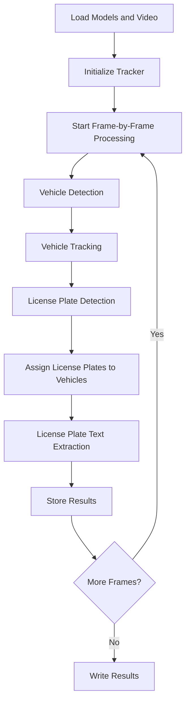

# Indian Vehicle License Plate Detection using Yolov8 and EasyOCR
This project involves detecting vehicles and reading their license plates from video footage. Utilizing YOLOv8 for object detection and the SORT algorithm for tracking, this system identifies vehicles and extracts license plate text, specifically focusing on Indian license plates.

<table>
  <tr>
    <td></td>
    <td></td>
  </tr>
</table>


## Introduction

This project aims to detect vehicles and read license plates from video footage. It leverages YOLOv8 for object detection and the SORT algorithm for tracking vehicles across frames. The detected license plates are then processed using EasyOCR to extract the text, with a focus on Indian license plate formats.

## Features

- Vehicle detection using YOLOv8.
- License plate detection using a custom YOLO model.
- Vehicle tracking using the SORT algorithm.
- License plate text extraction using EasyOCR.
- Handling of Indian license plate formats.

## Requirements

- Python 3.7+
- OpenCV
- NumPy
- EasyOCR
- Ultralytics YOLO
- SORT algorithm

## Installation

1. Clone the repository:
   ```sh
   git clone https://github.com/vn33/IndianVehicleLicensePlateDetection-using-Yolov8-and-EasyOCR.git
   cd vehicle-license-plate-detection

## Pipeline Structure

The pipeline for detecting and tracking vehicles and reading license plates is structured as follows:

### Load Models and Video:
- Load the YOLO models for vehicle and license plate detection.
- Load the video file for processing.

### Initialize Tracker:
- Initialize the SORT tracker to track detected vehicles.

### Frame-by-Frame Processing:
For each frame in the video:

#### Vehicle Detection:
- Detect vehicles using the YOLO model.
- Filter detections to include only vehicles (e.g., cars, motorcycles, buses).

#### Vehicle Tracking:
- Update the SORT tracker with the detected vehicles.

#### License Plate Detection:
- Detect license plates using the custom YOLO model.

#### Assign License Plates to Vehicles:
- Match detected license plates to the tracked vehicles.

#### License Plate Text Extraction:
- Crop and preprocess the license plate region.
- Use EasyOCR to read the license plate text.
- Format and validate the extracted text.

### Store Results:
- Store the detected and tracked vehicle and license plate information.

### Write Results:
- Write the results to a CSV file.

### Pipeline Structure Flowchart



## Acknowledgements

Thanks to the [SORT repository](https://github.com/abewley/sort) for the implementation of the SORT tracking algorithm.

## Contributing

Contributions are welcome! Please submit a pull request or open an issue for any feature requests or bug reports.

